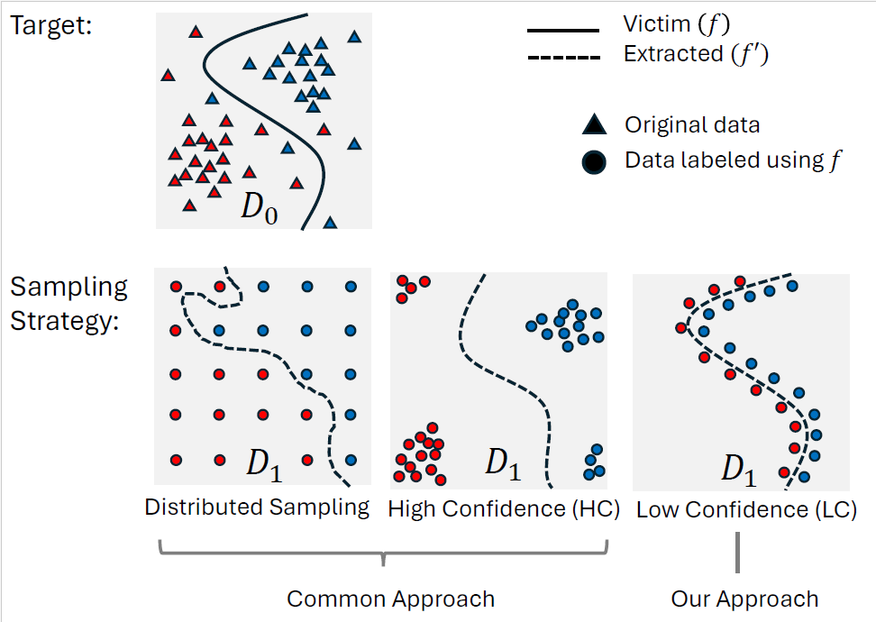

# Boundary Sampling for Efficient Model Extraction
## Overview
This repository contains an implementation of a model extraction algorithm that harnesses the power of evolutionary algorithms to efficiently extract the victim model with zero assumptions on the victim model training data. The algorithm is designed to extract black box models by only querying the model and sending input and receiving the output.



## Getting Started

To use the algorithm, follow these steps:

1. **Clone the Repository:** Clone this repository to your local machine using `git clone`.
2. **Install Dependencies:** Install the required dependencies listed in `requirements.txt`.
3. **Configure Parameters:** Adjust the algorithm parameters you send to the algorithm to suit your needs.
4. **Run the Algorithm:** Execute the main script to start the model extraction process.
5. **Evaluate Results:** Evaluate the extracted models based on their performance metrics and refine as necessary.

## Arguments

- **`--k`** (`int`, default=`6000`): Determines the number of samples selected to generate the next generation in the evolutionary algorithm.
- **`--epsilon`** (`float`, default=`0.0005`): Specifies the step size for generating the new generation in the evolutionary algorithm.
- **`--population_size`** (`int`, default=`20000`): Sets the population size for the evolutionary algorithm, affecting the diversity of solutions and computational requirements.
- **`--generations`** (`int`, default=`40`): Indicates the number of generations the evolutionary algorithm will iterate through.
- **`--search_spread`** (`int`, default=`10`): Defines the range of the search steps, controlling the spread during the search process.
- **`--epochs`** (`int`, default=`100`): Number of training epochs, specifying how many times the entire dataset is used for training.
- **`--dont_get_from_disk`** (`flag`): When set, prevents reading data from disk and generates a new dataset using the BAM algorithm.
- **`--num_of_classes`** (`int`, default=`10`): Number of classes in the classification task, defining the output dimension.
- **`--learning_rate`** (`float`, default=`0.3`): Learning rate used in the optimization process of the BAM algorithm.
- **`--optimizer_name`** (`str`, default=`"AdamW"`): Specifies the optimizer to use, such as `"Adam"`, `"SGD"`, or `"AdamW"`.
- **`--batch_size`** (`int`, default=`64`): Defines the batch size for training and prediction, impacting memory usage and processing speed.
- **`--delete_checkpoints`** (`flag`): When set, instructs the script to delete checkpoints from previous training sessions.
- **`--genetic_alg_prediction_max_batch_size`** (`int`, default=`100`): Maximum batch size for genetic algorithm predictions, set to manage memory constraints.
- **`--data_directory`** (`str`, default=`"/ssd/SaveDataset/Batches"`): Directory where the generated data during the BAM algorithm run is stored.
- **`--destination_folder`** (`str`, default=`"{data_directory}/{model_class}/{generations}_generations"`): Directory for saving the results of the BAM algorithm run.
- **`--file_path_confidence_batch`** (`str`, default=`"{destination_folder}/Toward_proxy_dataset_confidence_{generations}_batch_{gen_minus_one}_input.npy"`): File path for saving the confidence batch files generated during the BAM algorithm run.


## Example Usage

```python
from Config import Config
from Utility import (
    BAM_main_algorithm_tabular,
    prepare_config_and_log,
    generate_random_tabular_data_function, # This is the function that will generate a random data in the shape of the input for victim model.
)

prepare_config_and_log()
config = Config.instance # Setup the configuration file

# Define BAM algorithm parameters
num_of_classes = 12
k = 3000
epsilon = 0.05
population_size = 10000
generations = 30
search_spread = 10

# Load the victim model
victim_model = load_model() # This will need to be replaced by the user to load the relevant model to extract

# Run BAM algorithm
surrogate_model = BAM_main_algorithm_tabular(
    victim_model,
    SurrogateModelClass,
    generate_random_tabular_data_function,
    num_of_classes=num_of_classes,
    k=k,
    epsilon=epsilon,
    population_size=population_size,
    generations=generations,
    search_spread=search_spread,
)

surrogate_acc = surrogate_model.test_model() # This will need to be replaced by the user test function
print(f"The surrogate model accuracy is {surrogate_acc}")

